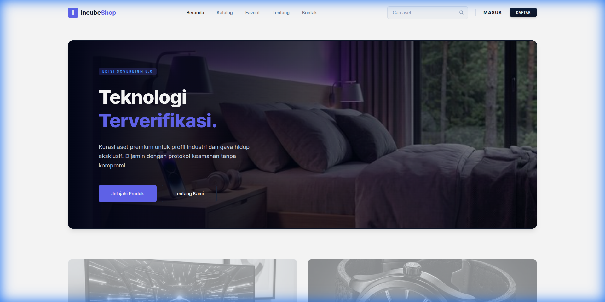
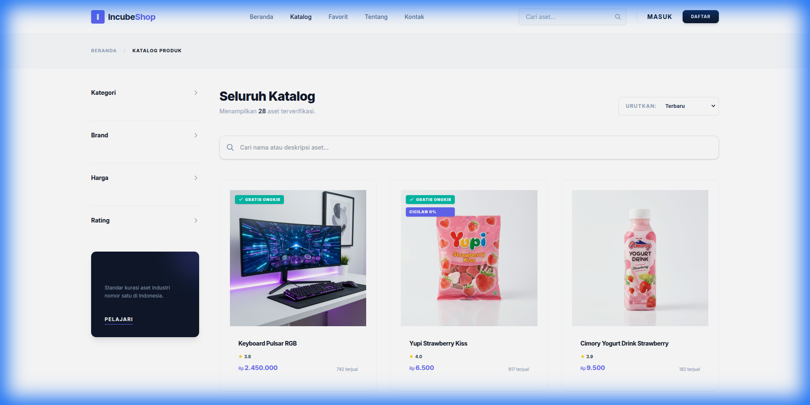
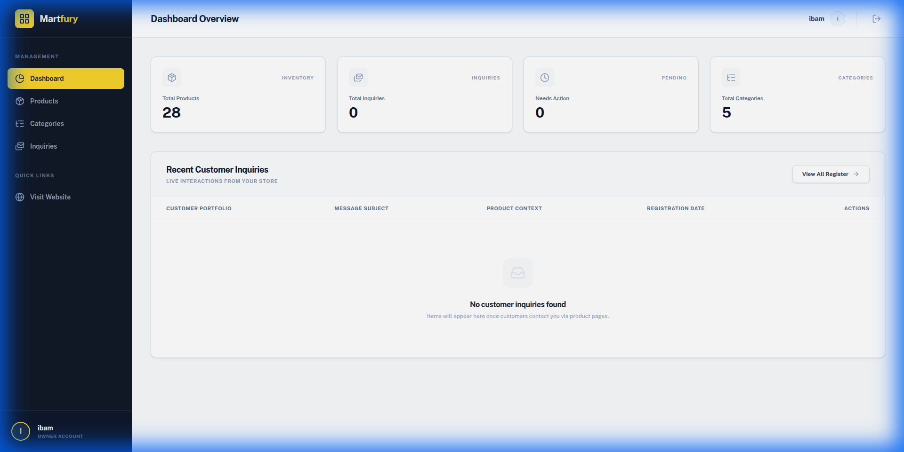

# LAPORAN PROGRESS PROJECT

**Nama Project :** IncubeShop (Katalog Marketplace)  
**Tanggal Laporan :** 23-02-2026  
**Status Project :** On Progress  

---

### 1. Ringkasan Progress Terakhir

1. **Home Page**: Implementasi antarmuka utama yang modern dan responsif.
2. **Product Catalog**: Sistem penampilan produk dinamis dengan berbagai kategori.
3. **Inquiry System**: Fitur pertanyaan pelanggan langsung dari halaman produk.
4. **Database (MySQL)**: Struktur penyimpanan data produk, kategori, dan pesan yang terorganisir.
5. **Search & Filter**: Fitur pencarian cepat dan penyaringan produk berbasis kriteria.
6. **Sistem Login & Register**: Autentikasi pengguna untuk keamanan dan fitur personalisasi (Favorit).
7. **Dashboard Admin**: Area khusus pengelolaan data inventory dan pemantauan pesan masuk.

---

### 2. Detail Pekerjaan yang Diselesaikan

*   **Backend:** Laravel (Framework PHP untuk logika sistem dan API).
*   **Frontend:** Tailwind CSS (Framework CSS untuk desain UI yang modern dan responsif).
*   **Database:** MySQL (Sistem database relasional untuk menyimpan data marketplace).

---

### 3. Tampilan Sistem (Lampiran Screenshot)

#### **A. Halaman Utama (Home Page)**

Antarmuka bersih dengan hero section "Teknologi Terverifikasi" dan navigasi yang mudah.

#### **B. Katalog Produk (Catalog Page)**

Menampilkan daftar inventaris produk secara dinamis lengkap dengan sidebar filter (Kategori, Brand, Harga, Rating).

#### **C. Dashboard Admin**

Pusat kontrol untuk mengelola produk (CRUD), melihat statistik, dan memantau pesan (Inquiries).

---

**Terimakasih....**
